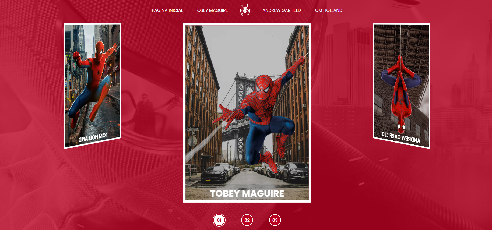

 

# spider_verso-website

> Este projeto foi desenvolvido para web com o objetivo de apresentar os três Homens-Aranha que tivemos ao longo do tempo, junto com seus respectivos filmes.

> A ideia central deste site é oferecer uma experiência visual única, destacando diferentes tecnologias e soluções criativas. Ele reflete meu processo criativo e o conhecimento técnico que venho adquirindo, além de ser uma oportunidade para praticar conceitos de cursos e artigos que estudei durante sua criação.

[Visite o projeto](https://guicarbar.github.io/spider_verso-website/)

## Tecnologias

  
  
  

## Contribuir

1. **Clonar projeto:**: `git clone https://github.com/guicarbar/spider_verso-website.git`
2. **Criar feature/branch:**: `git checkout -b feature/Nome-da-branch`

## Licença

Este projeto está sob a licença [MIT](LICENSE) License.